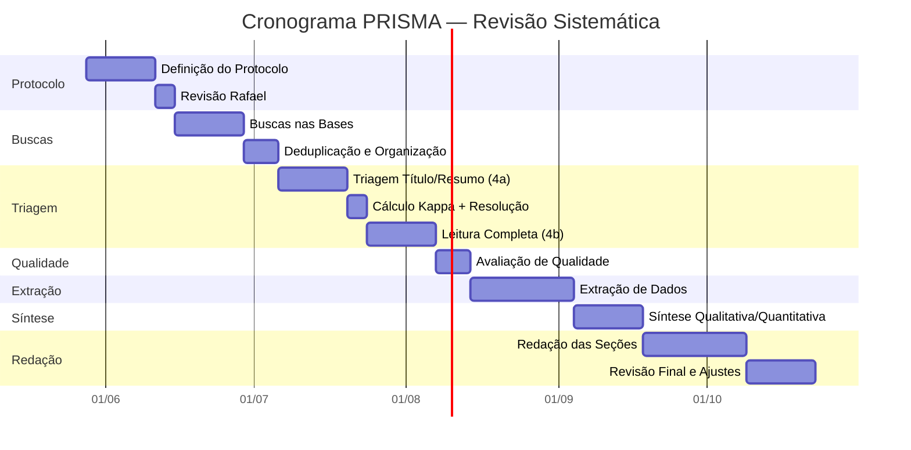
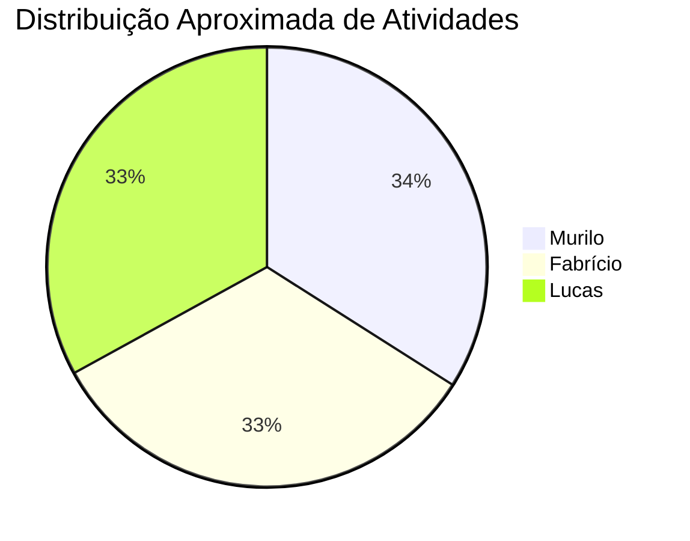

# 📅 Cronograma — Revisão Sistemática PRISMA
## Speech Analytics e Comunicação Clínica

**Projeto:** Revisão Bibliográfica Sistemática (IC — USF)
**Início:** 28/05/2026 · **Previsão de conclusão:** 15/10/2026 (~20 semanas)
**Equipe:** Murilo · Fabrício · Lucas · Rafael (orientador)

---

## Visão Geral do Fluxo

---

## Divisão de Responsabilidades por Eixo Temático

Cada estudante assume a **liderança** de eixos específicos durante extração, síntese e redação. Isso não impede colaboração, mas garante responsabilidade clara.

| Estudante | Eixos Primários | Justificativa |
|-----------|----------------|---------------|
| **Murilo** | **A** (NLP clínico, NER) + **E** (Avaliação de LLMs) | Eixos mais técnicos — extração de entidades, transformers, métricas de IA |
| **Fabrício** | **B** (Documentação automatizada, SOAP, ASR) + **D** (Biomarcadores vocais) | Eixos focados em pipeline de áudio → texto → estrutura |
| **Lucas** | **C** (Comunicação médico-paciente) + **F** (Ética e regulação) | Eixos com foco em dimensão humana, literacia e arcabouço normativo |
| **Rafael** | Supervisão transversal, validação metodológica, resolução de conflitos | Orientador — revisão em pontos-chave (gates) |

---

## Cronograma Detalhado por Fase

### Fase 1 — Definição do Protocolo
**📆 Semanas 1–2 (28/05 → 11/06)**

| Tarefa | Responsável | Prazo |
|--------|------------|-------|
| Refinar RQs (RQ1–RQ4) com base no escopo | Todos | 01/06 |
| Definir período de cobertura e bases de dados | Murilo | 03/06 |
| Redigir critérios IC/EC definitivos | Fabrício | 03/06 |
| Montar strings de busca por base (IEEE, PubMed, Scopus, WoS, arXiv, ACM) | Lucas | 05/06 |
| Definir checklist de qualidade (Dybå & Dingsøyr) | Murilo | 05/06 |
| Consolidar documento de protocolo | Todos | 08/06 |
| Registrar protocolo (OSF ou documento interno) | Murilo | 10/06 |

> [!IMPORTANT]
> **Gate 1 — Revisão Rafael (11/06 → 14/06)**
> Rafael revisa e aprova o protocolo antes de iniciar buscas. Nenhuma busca deve ser executada sem aprovação.

---

### Fase 2 — Buscas nas Bases de Dados
**📆 Semanas 3–4 (16/06 → 29/06)**

As bases são divididas entre os estudantes para execução paralela:

| Base | Responsável | Prazo |
|------|------------|-------|
| **PubMed / MEDLINE** | Murilo | 22/06 |
| **Scopus** | Murilo | 25/06 |
| **IEEE Xplore** | Fabrício | 22/06 |
| **ACM Digital Library** | Fabrício | 25/06 |
| **Web of Science** | Lucas | 22/06 |
| **arXiv** | Lucas | 25/06 |
| Registrar `BaseCitacoes.md` como fonte adicional | Murilo | 22/06 |
| Consolidar todos os resultados em planilha única | Todos | 29/06 |

> [!TIP]
> Cada estudante deve exportar os resultados em formato padronizado (RIS/BibTeX) e registrar: base, string utilizada, data da busca e número de resultados.

---

### Fase 3 — Deduplicação e Organização
**📆 Semana 5 (30/06 → 06/07)**

| Tarefa | Responsável | Prazo |
|--------|------------|-------|
| Importar todos os registros em ferramenta de gerenciamento (Zotero/Rayyan) | Fabrício | 01/07 |
| Executar deduplicação automática | Fabrício | 02/07 |
| Revisão manual dos casos ambíguos | Lucas | 04/07 |
| Registrar números no fluxo PRISMA (`MEMORIA.md`) | Murilo | 06/07 |

---

### Fase 4a — Triagem por Título e Resumo
**📆 Semanas 6–7 (07/07 → 20/07)**

> [!IMPORTANT]
> A triagem exige **dois revisores independentes** + cálculo de concordância (κ de Cohen). A divisão abaixo garante que cada artigo seja avaliado por pelo menos 2 pessoas.

| Tarefa | Responsável | Prazo |
|--------|------------|-------|
| **Revisor 1** — triagem independente (lote completo) | Murilo | 16/07 |
| **Revisor 2** — triagem independente (lote completo) | Fabrício | 16/07 |
| Calcular coeficiente kappa (κ) | Lucas | 18/07 |
| Resolução de desacordos (3º revisor) | Lucas + Rafael | 20/07 |
| Registrar incluídos/excluídos no fluxo PRISMA | Murilo | 20/07 |

> [!NOTE]
> Se o volume for muito grande (>500 artigos), dividir em sublotes e alternar pares de revisores para distribuir a carga.

---

### Fase 4b — Leitura Completa e Aplicação de IC/EC
**📆 Semanas 8–9 (21/07 → 03/08)**

Os artigos aprovados na triagem são divididos por eixo temático para leitura completa:

| Eixos | Responsável | Prazo |
|-------|------------|-------|
| Eixos A + E (NLP, LLMs) | Murilo | 31/07 |
| Eixos B + D (ASR, biomarcadores) | Fabrício | 31/07 |
| Eixos C + F (comunicação, ética) | Lucas | 31/07 |
| Consolidar tabela de exclusões com justificativas | Todos | 03/08 |

> [!IMPORTANT]
> **Gate 2 — Revisão Rafael (03/08 → 06/08)**
> Rafael revisa a lista final de artigos incluídos e excluídos, valida as justificativas de exclusão e aprova antes da extração.

---

### Fase 5 — Avaliação de Qualidade Metodológica
**📆 Semana 10 (07/08 → 13/08)**

| Tarefa | Responsável | Prazo |
|--------|------------|-------|
| Aplicar Dybå & Dingsøyr Q1–Q5 nos artigos dos Eixos A + E | Murilo | 11/08 |
| Aplicar Dybå & Dingsøyr Q1–Q5 nos artigos dos Eixos B + D | Fabrício | 11/08 |
| Aplicar Dybå & Dingsøyr Q1–Q5 nos artigos dos Eixos C + F | Lucas | 11/08 |
| Consolidar scores e classificar (qualitativa vs. quantitativa) | Todos | 13/08 |

> [!NOTE]
> Score < 2.5 → síntese qualitativa apenas · Score ≥ 2.5 → elegível para síntese quantitativa

---

### Fase 6 — Extração de Dados
**📆 Semanas 11–13 (14/08 → 03/09)**

Cada estudante extrai dados dos artigos dos seus eixos usando o [template padronizado](file:///c:/Dev/IC/IA.md#L263-L282).

| Eixos | Responsável | Prazo |
|-------|------------|-------|
| Eixo A — NLP clínico, NER biomédico | Murilo | 21/08 |
| Eixo E — Avaliação de LLMs | Murilo | 27/08 |
| Eixo B — Documentação automatizada, SOAP, ASR | Fabrício | 21/08 |
| Eixo D — Biomarcadores vocais | Fabrício | 27/08 |
| Eixo C — Comunicação médico-paciente | Lucas | 21/08 |
| Eixo F — Ética e regulação | Lucas | 27/08 |
| Revisão cruzada (cada um revisa a extração de outro) | Todos | 01/09 |
| Consolidação final das fichas de extração | Todos | 03/09 |

**Esquema de revisão cruzada:**
- Murilo revisa extrações de → Fabrício
- Fabrício revisa extrações de → Lucas
- Lucas revisa extrações de → Murilo

> [!IMPORTANT]
> **Gate 3 — Revisão Rafael (03/09 → 06/09)**
> Rafael valida amostra das extrações (≥20%) e aprova a base de dados para síntese.

---

### Fase 7 — Síntese
**📆 Semanas 14–15 (08/09 → 21/09)**

| Tarefa | Responsável | Prazo |
|--------|------------|-------|
| Síntese qualitativa — RQ1 (abordagens de Speech Analytics) | Fabrício | 14/09 |
| Síntese qualitativa — RQ2 (métodos NLP e ASR) | Murilo | 14/09 |
| Síntese qualitativa — RQ3 (marcadores comunicacionais) | Lucas | 14/09 |
| Síntese qualitativa — RQ4 (desafios técnicos, éticos, metodológicos) | Todos | 17/09 |
| Síntese quantitativa (F1, WER, κ — quando aplicável) | Murilo | 19/09 |
| Conexão explícita com a lacuna da Fase 2 | Todos | 21/09 |

---

### Fase 8 — Redação do Manuscrito
**📆 Semanas 16–18 (22/09 → 12/10)**

| Seção | Responsável | Prazo |
|-------|------------|-------|
| **Introdução** (contexto + lacuna + objetivo) | Lucas | 28/09 |
| **Metodologia** (protocolo PRISMA, IC/EC, qualidade) | Fabrício | 28/09 |
| **Resultados** — Fluxo PRISMA + tabelas de estudos | Murilo | 02/10 |
| **Resultados** — Síntese por eixo e RQ | Todos (cada um nos seus eixos) | 05/10 |
| **Discussão** (integração, implicações Fase 2, limitações) | Murilo + Lucas | 08/10 |
| **Conclusão** | Fabrício | 10/10 |
| **Referências** — formatação e verificação | Lucas | 12/10 |

> [!IMPORTANT]
> **Gate 4 — Revisão Rafael (12/10 → 15/10)**
> Rafael faz revisão integral do manuscrito, verifica rastreabilidade frase-fonte e aprova versão final.

---

### Fase 9 — Revisão Final e Submissão
**📆 Semanas 19–20 (13/10 → 26/10)**

| Tarefa | Responsável | Prazo |
|--------|------------|-------|
| Incorporar feedback do Rafael | Todos | 17/10 |
| Verificação cruzada final (checklist de segurança do [IA.md](file:///c:/Dev/IC/IA.md#L496-L505)) | Todos | 19/10 |
| Formatação conforme normas do periódico-alvo | Fabrício | 22/10 |
| Preparação de material suplementar | Lucas | 22/10 |
| Revisão final de linguagem | Murilo | 24/10 |
| **Submissão** | Todos + Rafael | 26/10 |

---

## Resumo de Gates de Revisão do Rafael

| Gate | Data | O que Rafael revisa |
|------|------|---------------------|
| **Gate 1** | 11–14/06 | Protocolo completo (RQs, IC/EC, strings, bases) |
| **Gate 2** | 03–06/08 | Lista de artigos incluídos/excluídos + justificativas |
| **Gate 3** | 03–06/09 | Amostra das fichas de extração (≥20%) |
| **Gate 4** | 12–15/10 | Manuscrito completo — revisão integral |

---

## Marcos de Entrega (Milestones)

| # | Marco | Data | Critério de conclusão |
|---|-------|------|-----------------------|
| M1 | Protocolo aprovado | 14/06 | Rafael aprovou protocolo |
| M2 | Buscas concluídas | 29/06 | Resultados de todas as bases consolidados |
| M3 | Corpus deduplicado | 06/07 | Registros limpos em ferramenta de gerenciamento |
| M4 | Triagem concluída | 20/07 | κ calculado, desacordos resolvidos |
| M5 | Artigos incluídos definidos | 06/08 | Rafael aprovou lista final |
| M6 | Extração concluída | 06/09 | Rafael validou amostra |
| M7 | Síntese pronta | 21/09 | Sínteses quali + quanti por RQ |
| M8 | Manuscrito redigido | 12/10 | Versão completa para revisão |
| M9 | Submissão | 26/10 | Paper submetido ao periódico |

---

## Distribuição de Carga por Estudante

| Estudante | Foco principal | Papéis-chave |
|-----------|---------------|--------------|
| **Murilo** | NLP técnico + coordenação de dados | Revisor 1 na triagem, síntese quantitativa, resultados PRISMA, registro do protocolo |
| **Fabrício** | Pipeline de áudio e documentação | Revisor 2 na triagem, gerenciamento Zotero/Rayyan, metodologia, conclusão |
| **Lucas** | Dimensão humana e normativa | 3º revisor (conflitos), kappa, introdução, referências, ética |
| **Rafael** | Supervisão e validação | 4 gates de revisão, resolução de conflitos, aprovação final |

---

## Regras de Trabalho

1. **Reuniões semanais** — Todos (incluindo Rafael quando possível), para alinhar progresso e resolver bloqueios
2. **Commits por etapa** — Cada etapa concluída = 1 commit no repositório
3. **Atualizar MEMORIA.md** — Após cada rodada de busca ou mudança no fluxo PRISMA
4. **Pasta `trabalho/`** — Cada estudante salva suas extrações e sínteses em arquivos separados dentro de `trabalho/`
5. **Dúvidas metodológicas** — Levar ao Rafael, não resolver por suposição

> [!CAUTION]
> Lembre-se: o trabalho da revisão é **paralelo à coleta de dados da Fase 2**. Se houver conflito de agenda, priorizar conforme orientação do Rafael. Os prazos acima podem ser ajustados — o importante é manter a sequência das etapas PRISMA.
